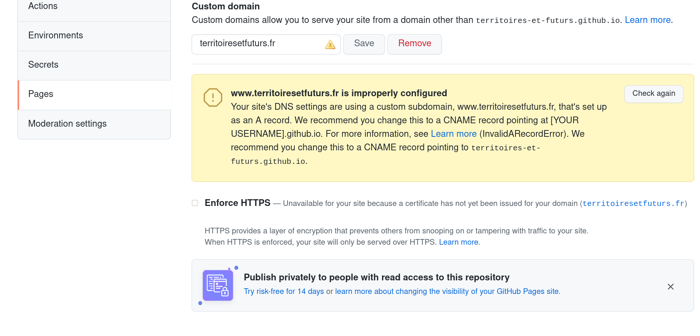
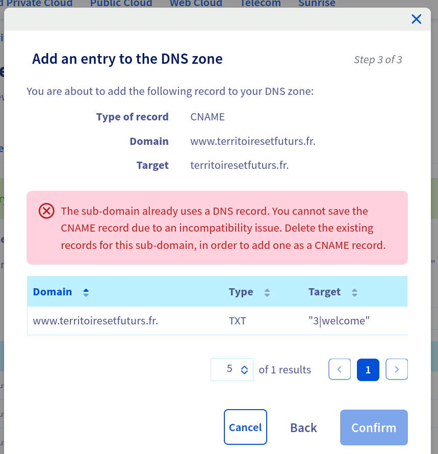
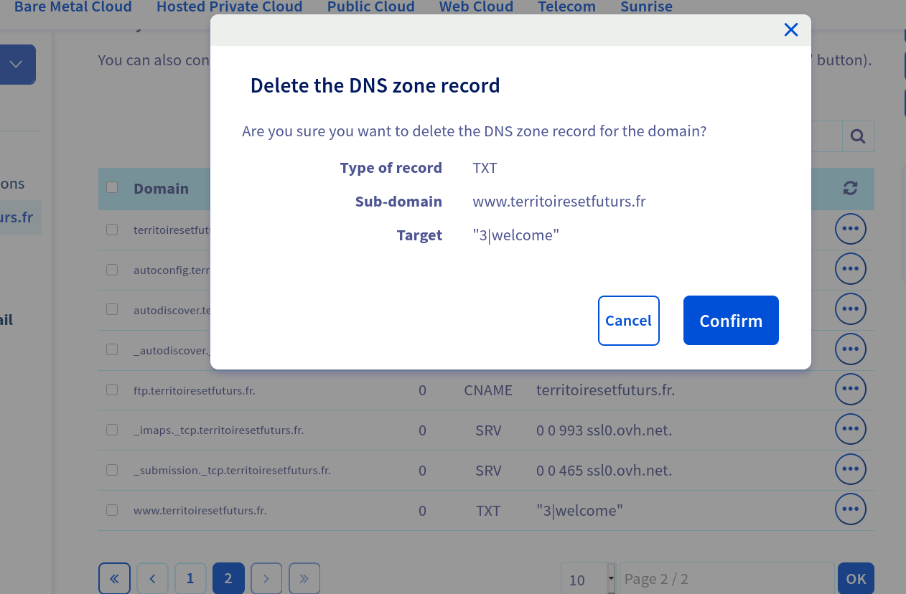
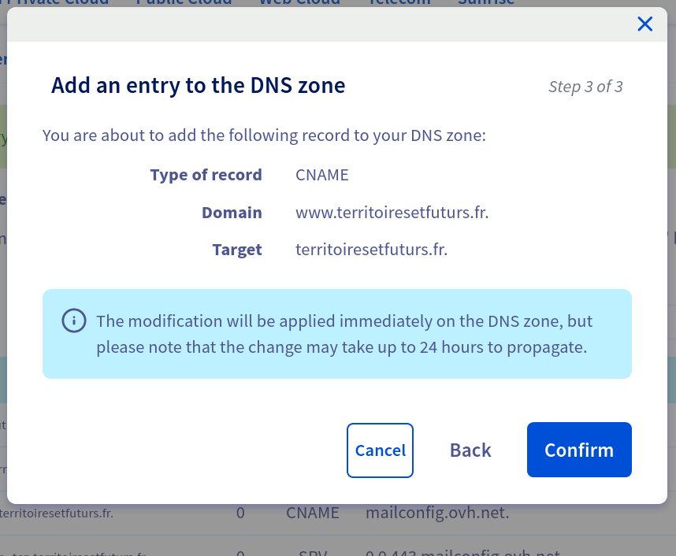
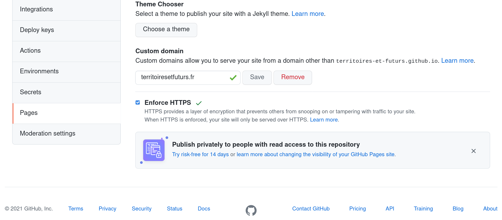

https://docs.github.com/en/pages/configuring-a-custom-domain-for-your-github-pages-site/managing-a-custom-domain-for-your-github-pages-site

On OVH Manager, deleted the following records :
* `rotorock.io` `51.91.236.193 ` (`A` record)
* `www.rotorock.io` `51.91.236.193 ` (`A` record)

and created the following `A` records for Github Pages :

* `rotorock.io` `185.199.108.153` (`A` record)
* `www.rotorock.io` `185.199.108.153` (`A` record)

* `rotorock.io` `185.199.109.153` (`A` record)
* `www.rotorock.io` `185.199.109.153` (`A` record)

* `rotorock.io` `185.199.110.153` (`A` record)
* `www.rotorock.io` `185.199.110.153` (`A` record)

* `rotorock.io` `185.199.111.153` (`A` record)
* `www.rotorock.io` `185.199.111.153` (`A` record)

now i have :

So I :

* deleted the records :
  * `www.rotorock.io` `185.199.108.153` (`A` record)
  * `www.rotorock.io` `185.199.109.153` (`A` record)
  * `www.rotorock.io` `185.199.110.153` (`A` record)
  * `www.rotorock.io` `185.199.111.153` (`A` record)
* and recreated them as one CNAME record :
  * `www.rotorock.io` `rotorock.io` (`CNAME` record)

Doing that, I got :

so i deleted :

and i could finally created the `CNAME` record :

Then i could check the checkbox to enforce ssl termination on github pages :

